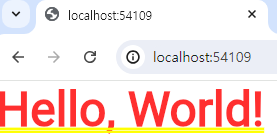

기본 위젯 4개만 알면 기초 끝이라고 한다.

우선 시작하기 전, analysis_options.yaml 파일을 수정하자

## 세팅


analysis_options.yaml 파일을 열어보면, 이렇게 세팅되어 있을 것이다.

rules 란에 아래 코드를 추가하자.

```yaml
rules:
  prefer_typing_uninitialized_variables : false	// 앞에 스페이스바 2개
  prefer_const_constructors_in_immutables : false
  prefer_const_constructors : false
  avoid_print : false
```

각각 어떤 규칙인지 알아보자.

1. `prefer_typing_uninitialized_variables`
	+ 설명 : 초기화되지 않은 변수에 명시적으로 타입을 지정하도록 권장한다.
    + 예시
    ```dart
    // 권장되지 않음
    var foo;
    
    // 권장됨
    String foo;
    ```
    
2. `prefer_const_constructors_in_immutables`
	+ 설명 : 불변 클래스(immutable class)에서 생성자를 상수 생성자로 만들도록 권장한다.
    + 예시
    
    ```dart
    class MyWidget extends StatelessWidget {
    	// 권장되지 않음
        MyWidget();
        
        // 권장됨
        const MyWidget();
    }
    ```
    
3. `prefer_const_constructors`

	+ 설명 : 가능한 곳에서는 항상 상수 생성자를 사용하도록 권장한다.
    + 예시
    
    ```dart
    // 권장되지 않음
    var foo = MyClass();
    
    // 권장됨
    var foo = const MyClass();
    ```
    
4. `avoid_print`
	+ 설명 : `print()` 함수 대신에 로깅(logging) 패키지를 사용하도록 권장한다.
    		`print()`는 디버깅 목적으로만 사용되며, 프로덕션 코드에서는 적절한 로깅 프레임워크를 사용하는 것이 좋다.
            
	+ 예시
    ```dart
    // 권장되지 않음
    print('Hello, World!');
    
    // 권장됨
    final logger = Logger('MyLogger');
    logger.info('Hello, World!');
    ```

모두 false로 설정하면 Dart 분석기가 위의 네 가지 규칙을 검사하지 않게 된다.

---

## main


main.dart를 열어보면, 길게 세팅되어 있다.

구글이 이해하기 쉽도록 쉬운 프로젝트 하나를 생성해주었다.

void main() 밑은 싹~ 다 지우자.


stless를 입력한 뒤 tab 키를 누르면


이런 식으로 자동완성이 된다.


MyApp을 입력해주면 아래와 같이 될 것이다.

```dart
import 'package:flutter/material.dart'; // 다른 파일 or package import

void main() {
  runApp(const MyApp());	// runApp : app 구동. MyApp 자리에 앱 메인페이지 입력
}

class MyApp extends StatelessWidget {	// 앱 메인페이지. 기본적으로 채워야하는 문법
  const MyApp({super.key});
  @override
  Widget build(BuildContext context) {

    return MaterialApp( // 실질적 코드 작성
      home: 
    );

  }
}
```

이러면 메인페이지 세팅은 끝이다.

앱 디자인을 넣는 법을 배워보자.

---

## Design

Flutter에서 디자인하는 방법은, Widget 짜집기하는 식으로 디자인한다고 보면 된다.

글자를 넣고 싶으면 글자 위젯, 박스를 넣고 싶으면 박스 위젯을 넣어서 짜집기 하면 된다.

Widget의 개념이 매우 중요하다.

우선 글자 먼저 넣어보자.

```dart
return MaterialApp(
  home: Text('Hello, World!')
);
```

위 코드처럼 수정한 후 Chrome으로 main.dart를 실행하였다.

 